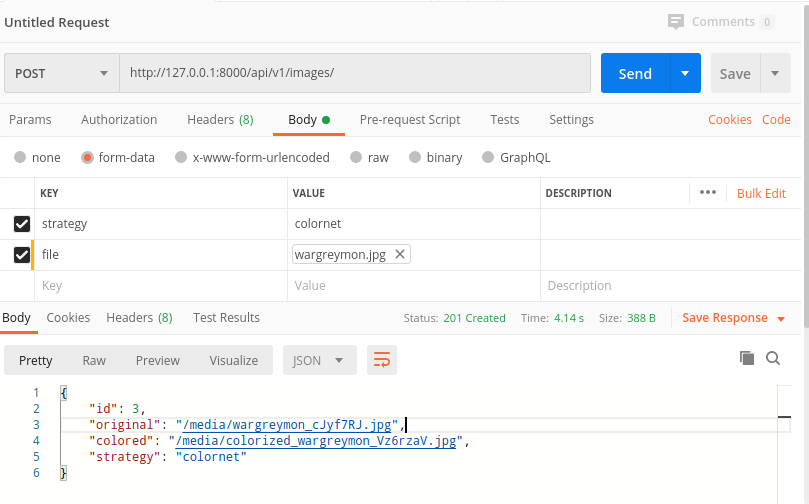

# Imaginator Backend 

This is the backend for the image colorizer application.

It consists of 2 packages:
- ```backendsite```: The Django project
- ```imaginator```: The actual app that does all the work

## Setup

Getting started:

```bash
git clone https://github.com/INF-HS-KL-BEGGEL/DL-SS20-T1-image-col
cd DL-SS20-T1-image-col
pip install -e deepcolor/
pip install -e backend/
```

The ```-e``` parameter ensures that the packages are installed in *editable* mode. 

## Run

To run the backend website locally, execute following commands:

```bash
python backend/manage.py migrate
python backend/manage.py runserver
```

Then open [127.0.0.1:8000](127.0.0.1:8000) in your webbrowser

## Endpoints

### List available colorization strategies

```http request
GET /api/v1/strategies/
```

Response:

```json
{
    "strategies": [
        {
            "name": "Richard Zhang",
            "var": "richzhang"
        },
        {
            "name": "Colornet",
            "var": "colornet"
        },
        {
            "name": "neural-colorization",
            "var": "zeruniverse"
        }
    ]
}
```

### Upload an image

```http request
POST /api/v1/images/
```

with:

```http request
file: <file>
strategy: <strategy>
```

Where ```<file>``` should be an image file.
Available stratgies are: ```colornet```, ```richzhang``` and ```zeruniverse```. 
For more information see the ```deepcolor``` package in the parent directory.

### List colorized images

```http request
GET /api/v1/images/
```

### List a single colorized image

```http request
GET /api/v1/images/<id>/
```

### Delete image

```http request
DELETE /api/v1/images/<id>/
```

## Exploration

You can explore the backend with tools like [Postman](https://www.postman.com/).

First make sure that the backend is running:

```bash
python backend/manage.py runserver
```

```
Performing system checks...

System check identified no issues (0 silenced).
June 25, 2020 - 10:34:57
Django version 3.0.5, using settings 'backendsite.settings'
Starting development server at http://127.0.0.1:8000/
Quit the server with CONTROL-C.
```

Then start the Postman application and explore the previously described endpoints.



## Development

During development it is recommended to work with a virtual environment (```venv```):

```bash
git clone https://github.com/INF-HS-KL-BEGGEL/DL-SS20-T1-image-col
cd DL-SS20-T1-image-col
python -m venv venv
. venv/bin/activate
pip install -e deepcolor/
pip install -e backend/
pip install -r testing-requirements.txt
cd backend
```

Then you can start editing your files as you wish.

### Testing

Make sure that you have followed the steps described above first, and then execute the following command:

```bash
pytest
```

```
============================= test session starts ==============================
platform linux -- Python 3.8.3, pytest-5.4.3, py-1.8.2, pluggy-0.13.1
rootdir: /why/so/nosy/DL-SS20-T1-image-col/deepcolor, inifile: pytest.ini
plugins: cov-2.10.0, django-3.9.0
collected 13 items                                                             

tests/test_core.py .s                                                    [ 15%]
tests/test_exceptions.py .                                               [ 23%]
tests/test_richzhang.py ss                                               [ 38%]
tests/test_strategies.py ..                                              [ 53%]
tests/test_utils.py ......                                               [100%]

================== 10 passed, 3 skipped, 0 warnings in 2.06s ==================
```
