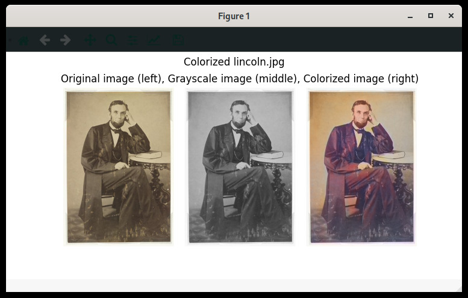

# deepcolor

A tool to colorize black and white pictures, based on [Colorful Image Colorization by Richard Zhang](https://github.com/richzhang/colorization).

## Prerequisites

- [Python 3.6+](https://www.python.org/)
- [caffe](https://caffe.berkeleyvision.org/installation.html)

## Installation

```bash
git clone https://github.com/INF-HS-KL-BEGGEL/DL-SS20-T1-image-col.git
cd DL-SS20-T1-image-col/
pip install deepcolor/
```

## Usage

```bash
usage: deepcolor [-h] [--version] image

deepcoor - A tool to colorize black and white pictures

positional arguments:
  image       Image path

optional arguments:
  -h, --help  show this help message and exit
  --version   show program's version number and exit
```

### Example

```
deepcolor data/lincoln.jpg
```

Result:

```
   _                     _ 
 _| |___ ___ ___ ___ ___| |___ ___ 
| . | -_| -_| . |  _| . | | . |  _|
|___|___|___|  _|___|___|_|___|_|
            |_|              v0.1.0

Converting JPEG image with mode RGB to grayscale
Loading pretrained model from /home/why/so/nosy/deepcolor/resources/colorization_release_v2.caffemodel
Loading cluster centers from /home/why/so/nosy/deepcolor/resources/pts_in_hull.npy
Annealed-Mean Parameters populated
Original dimensions: (640, 444)
Input dimensions: (224, 224)
Output dimensions: (56, 56)
Predicted a*b*-Dimensions: (56, 56, 2)
Upscaled predicted a*b*-Dimensions: (640, 444, 2)
Concatenated L*a*b*-Dimensions: (640, 444, 3)
```


