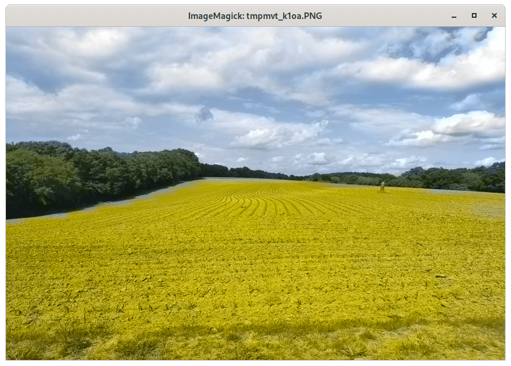
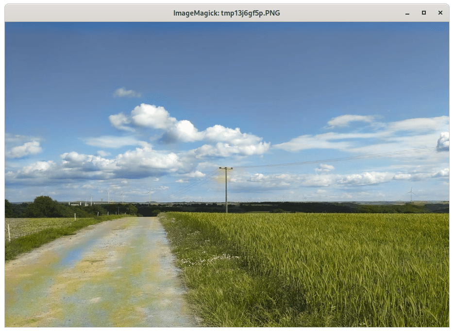
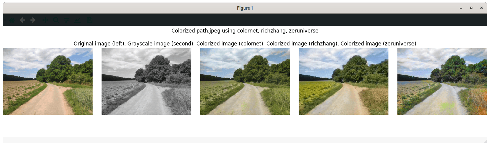

# deepcolor

A tool to colorize black and white pictures, based on [Colorful Image Colorization by Richard Zhang](https://github.com/richzhang/colorization), [Let there be Color!" by Satoshi Iizuka](http://iizuka.cs.tsukuba.ac.jp/projects/colorization/en/) and [neural-colorization by Jeffery (Zeyu) Zhao](https://github.com/zeruniverse/neural-colorization).

## Prerequisites

- [Python 3.6+](https://www.python.org/)
- [caffe](https://caffe.berkeleyvision.org/installation.html)
- [Pytorch](https://pytorch.org/)

## Installation

```bash
git clone https://github.com/INF-HS-KL-BEGGEL/DL-SS20-T1-image-col.git
cd DL-SS20-T1-image-col/
pip install deepcolor/
```

## Colorization stragies

### ```richzhang```

The first colorization stragety used by this project was based on [Colorful Image Colorization by Richard Zhang](https://github.com/richzhang/colorization). 

You colorize in image using this method by passing by using the ```richzhang``` module:

#### Example:

```python
import deepcolor
from deepcolor import richzhang
from PIL import Image

image = Image.open("data/acker.jpeg")
colorization_strategy = richzhang.colorize_image
colorized_image = deepcolor.colorize_image(image=image, strategy=colorization_strategy)
colorized_image.show()
```



### ```colornet```

The ```colornet``` uses a self trained neural network based on [Let there be Color!" by Satoshi Iizuka](http://iizuka.cs.tsukuba.ac.jp/projects/colorization/en/) and [colorNet-pytorch](https://github.com/shufanwu/colorNet-pytorch).

#### Example:

```python
import deepcolor
from deepcolor import colornet
from PIL import Image

image = Image.open("data/sky.jpeg")
colorization_strategy = colornet.colorize_image
colorized_image = deepcolor.colorize_image(image=image, strategy=colorization_strategy)
colorized_image.show()
```




### ```zeruniverse```

The ```zeruniverse``` uses a neural network based on [neural-colorization by Jeffery (Zeyu) Zhao](https://github.com/zeruniverse/neural-colorization).

#### Example:

```python
import deepcolor
from deepcolor import zeruniverse
from PIL import Image

image = Image.open("data/bathtub.jpg")
colorization_strategy = zeruniverse.colorize_image
colorized_image = deepcolor.colorize_image(image=image, strategy=colorization_strategy)
colorized_image.show()
```


## Command line tool

You can also color your images without using python code. 
For this purpose the ```deepcolor``` command line tool will be installed along with the project itself.
All colorized images will be saved as ```colorized_<old_filename>_strategy.<suffix>```

### Usage

```bash
usage: deepcolor [-h] [--version] [--strategy STRATEGY [STRATEGY ...]] [--gpu] image

deepcolor - A tool to colorize black and white pictures

positional arguments:
  image                               Image path

optional arguments:
  -h, --help                          show this help message and exit
  --version                           show program's version number and exit
  --strategy STRATEGY [STRATEGY ...]  Colorization strategies to use. Available strategies: richzhang, colornet, zeruniverse
  --gpu                               Run in CUDA mode rather than CPU
```

### Example 1

This command colorizes the image located in ```data/hill.jpeg``` using the ```colornet``` strategy

```bash
deepcolor data/hill.jpeg --strategy colornet
```

#### Result

```
   _                     _ 
 _| |___ ___ ___ ___ ___| |___ ___ 
| . | -_| -_| . |  _| . | | . |  _|
|___|___|___|  _|___|___|_|___|_|
            |_|              v0.2.0

Converting None image with mode RGB to grayscale

Colorizing image using colornet strategy.
strategy_name: colornet
short:         Colornet
description:   Self trained network based on "Let there be Color!" by Satoshi Iizuka
url:           http://iizuka.cs.tsukuba.ac.jp/projects/colorization/en/

Saving colorized image as colorized_hill_colornet.jpeg 
```


### Example 2

You can also specify several strategies at once to obtain a side-by-side comparison.

```bash
deepcolor data/path.jpeg --strategy colornet richzhang zeruniverse
```

#### Result

```
   _                     _ 
 _| |___ ___ ___ ___ ___| |___ ___ 
| . | -_| -_| . |  _| . | | . |  _|
|___|___|___|  _|___|___|_|___|_|
            |_|              v0.2.0

Converting None image with mode RGB to grayscale

Colorizing image using colornet strategy.
strategy_name: colornet
short:         Colornet
description:   Self trained network based on "Let there be Color!" by Satoshi Iizuka
url:           http://iizuka.cs.tsukuba.ac.jp/projects/colorization/en/

Saving colorized image as colorized_path_colornet.jpeg 

Colorizing image using richzhang strategy.
strategy_name: richzhang
short:         Richard Zhang
description:   "Colorful Image Colorization" by Richard Zhang
url:           https://richzhang.github.io/

Saving colorized image as colorized_path_richzhang.jpeg 

Colorizing image using zeruniverse strategy.
strategy_name: zeruniverse
short:         neural-colorization
description:   "neural-colorization" by Jeffery (Zeyu) Zhao
url:           https://github.com/zeruniverse/neural-colorization

Saving colorized image as colorized_path_zeruniverse.jpeg 
```



## Development

During development it is recommended to work with a virtual environment (```venv```):

```bash
git clone https://github.com/INF-HS-KL-BEGGEL/DL-SS20-T1-image-col
cd DL-SS20-T1-image-col
python -m venv venv
. venv/bin/activate
pip install -e deepcolor/
pip install -r testing-requirements.txt
cd deepcolor
```

Then you can start editing your files as you wish.

### Testing

Make sure that you have followed the steps described above first, and then execute the following command:

```bash
pytest
```

```
====================================== test session starts =======================================
platform linux -- Python 3.8.3, pytest-5.4.3, py-1.8.1, pluggy-0.13.1
rootdir: /why/so/nosy/DL-SS20-T1-image-col/deepcolor, inifile: pytest.ini
plugins: cov-2.8.1, django-3.9.0
collected 13 items                                                                               

tests/test_core.py ..                                                                      [ 15%]
tests/test_exceptions.py .                                                                 [ 23%]
tests/test_richzhang.py ..                                                                 [ 38%]
tests/test_strategies.py ..                                                                [ 53%]
tests/test_utils.py ......                                                                 [100%]

======================================= 13 passed in 6.41s =======================================
```

## Credits:

- http://richzhang.github.io/colorization/
- http://iizuka.cs.tsukuba.ac.jp/projects/colorization/en/
- https://github.com/shufanwu/colorNet-pytorch
- https://github.com/zeruniverse/neural-colorization