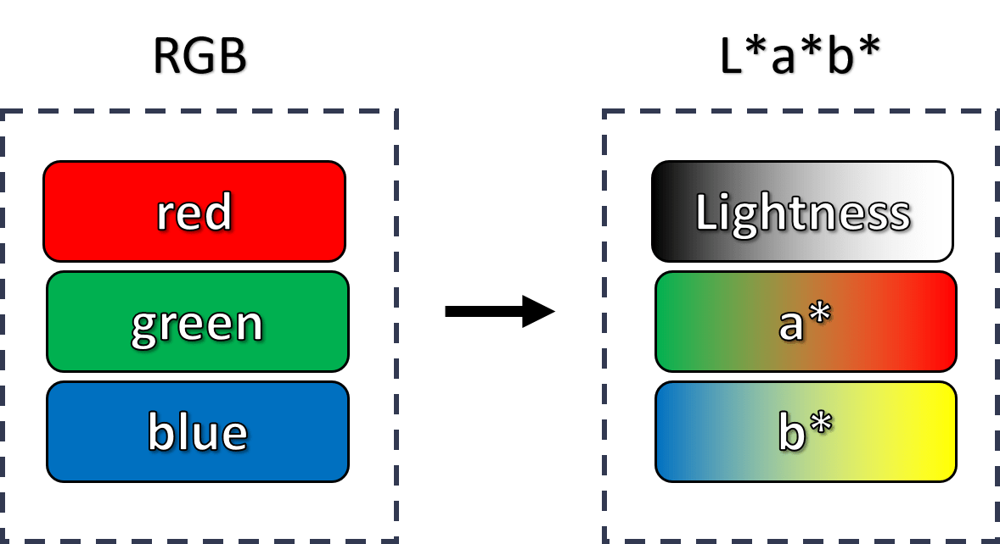

# Image Colorization

*Deep Learning, Hochschule Kaiserslautern*
*30. June 2020*

This project is about the colorization of black and white images. 
The goal of the project was to create a website where you can upload a black and white image and get the colored image back. 
The "Colorful Image Colorization" project by Richard Zhang served as a reference, providing the website, the neural network architecture and a descriptive paper. In addition to the network just described, an own network "colornet" was trained. 
This project can be extended by further colorization strategies, because an interface was introduced that is used dynamically by the website.

## Concept



Grayscale images usually only have pixel values in the L* (Lightness) channel. 
This property can be exploited to use a deep neural network for coloring images.
First, images that are usually in RGB mode must be converted to the L*a*b* color space. 
Then the L* channel can be extracted and fed into the neural network.

In the L*a*b* color space the color of an pixel is determined by three values: 

 - L* for the lightness from black (0) to white (100) 
 - a* from green (−) to red (+) 
 - b* from blue (−) to yellow (+)

Given the L* channel of an image and a convolutional neural network, the a* and b* color channel values should therefore be predicted.
All three channels of all pixels combined result in the colored image.


This also means that any existing color photo can be used to train the neural network by simply converting it to the appropriate color space and using the channels as features and labels.

## Architecture

This project was divided into three isolated units. 
The centrepiece of the project is the Python package ```deepcolor```, which is responsible for the application of the deep learning algorithms. 
This package also provides a command line client that allows the colorization of images via the console according to the desired network.

The ```deepcolor``` package is used by the ```backend```, which provides a REST interface that is used by ```frontend```.


### ```deepcolor```

Describe how it works

### ```backend```

Describe how it works

- Django
- Django REST framework
- Endpoints

### ```frontend```

Describe how it works

- React
