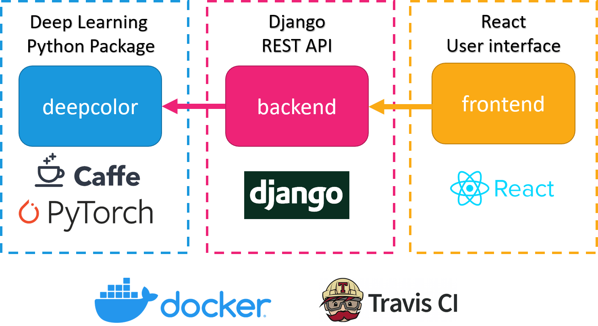
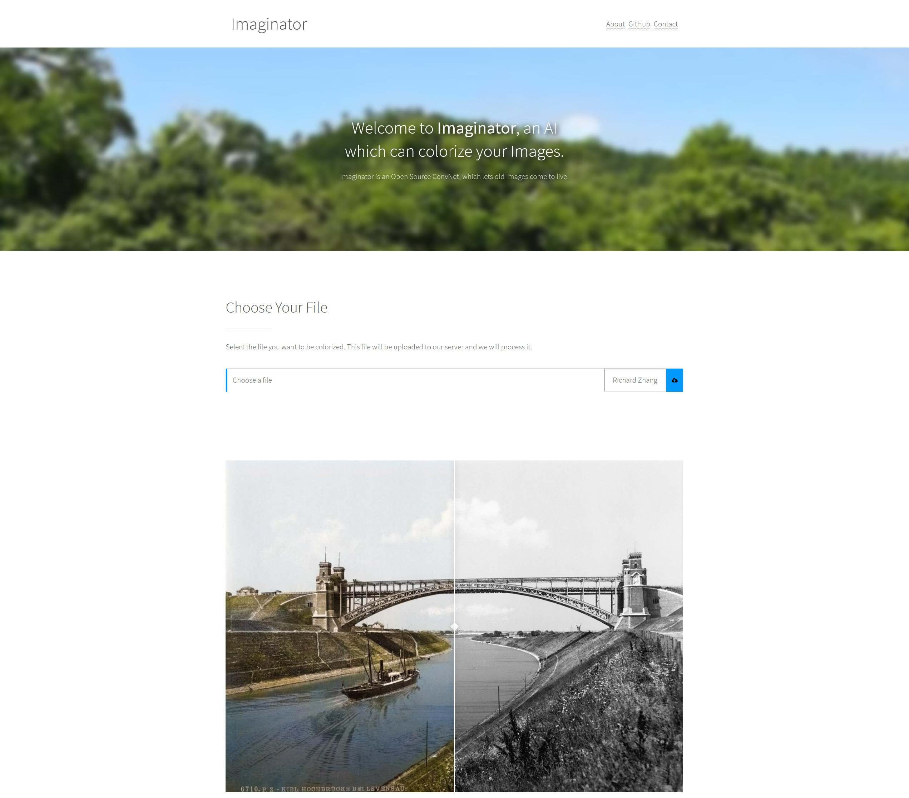

# Image Colorization

*Deep Learning, Hochschule Kaiserslautern*, *30. June 2020*

This project is about the colorization of black and white images. The goal of the project was to create a website where you can upload a black and white image and get the colored image back. The "Colorful Image Colorization" project by Richard Zhang served as a reference, providing the website, the neural network architecture and a descriptive paper. In addition to the network just described, an own network "colornet" was trained. This project can be extended by further colorization strategies, because an interface was introduced that is used dynamically by the website.

## Concept


Grayscale images usually only have pixel values in the L\* (Lightness) channel. This property can be exploited to use a deep neural network for coloring images. First, images that are usually in RGB mode must be converted to the L\*a\*b\* color space. Then the L\* channel can be extracted and fed into the neural network.

In the L\*a\*b\* color space the color of an pixel is determined by three values:

 - L\* for the lightness from black (0) to white (100)
 - a\* from green (−) to red (+)
 - b\* from blue (−) to yellow (+)

Given the L\* channel of an image and a convolutional neural network, the a\* and b\* color channel values should therefore be predicted. All three channels of all pixels combined result in the colored image.

This also means that any existing color photo can be used to train the neural network by simply converting it to the appropriate color space and using the channels as features and labels.

## Architecture

This project was divided into three isolated units. The centerpiece of the project is the Python package ```deepcolor```, which is responsible for the application of the deep learning algorithms. This package also provides a command line client that allows the colorization of images via the console according to the desired network.

The ```deepcolor``` package is used by the ```backend```, which provides a REST interface that is used by ```frontend```. All communication to the outside is done over a nginx reverse proxy which manages the public visible entry points.



### ```deepcolor```

As previously described, is the purpose of the deepcolor package the implementation of the colorization of the images. It has defined a kind of interface that uses the strategy pattern:

```python
def colorize_image(image: Image, strategy, gpu=False) -> Image:
    if not strategy:
        return image
    return strategy(image, gpu)
```

The strategy parameter is a python function that takes an Image and returns a colorized image. Three different colorization strategies were implemented, which will be described in the following chapters:

| ```strategy``` | Description                                                            | Link                                                     |
|----------------|------------------------------------------------------------------------|----------------------------------------------------------|
| richzhang      | "Colorful Image Colorization" by Richard Zhang                         | https://richzhang.github.io/                             |
| colornet       | Self trained network based on "Let there be Color!" by Satoshi Iizuka' | http://iizuka.cs.tsukuba.ac.jp/projects/colorization/en/ |
| zeruniverse    | "neural-colorization" by Jeffery (Zeyu) Zhao                           | https://github.com/zeruniverse/neural-colorization       |


#### Colorful image colorization

The first colorization network that has been implemented was taken from the "Colorful Image Colorization" by Richard Zhang. It makes use of the L\*a\*b\* color space by training on the L channel. The a and b channels of an image, which are responsible for the actual colors, are the predicted labels.


#### Let there be Color!


The Let there be Color! network consists of two separate networks: one for image classification and one for the feature detection. Both are combined in a Fusion Layer which then is the input for the main colorization. This will stabilize the color pallet selection for different settings. A dawn image needs different overall colors than a sea image. With this classification it would also be possible to use this network for classification only. However, the labels produced from the network are a description for the whole image, like "dawn", and not parts of it, like "human". Examples of the Networks different color pallets can be seen below:

Dawn                           |  Sea
:-----------------------------:|:-------------------------:
  |  

To train the network you have to use the provided `train.py`. The provided Code is using AdamW optimizer, but as stated in the Paper a Adadelta optimizer is also possible. As the network has multiple parameters for Optimization (Labels and Colors) they need to be weighted to each other, a fully detailed explanation of the parameterization of the network can be found in deepcolor/Readme.md.

#### Command line client

The ```deepcolor``` package also provides a command line client that allows the colorization of images by using a terminal emulator.
It takes both the ```path``` to the image to be colorized and the colorization ```strategy``` as input. 
Multiple colorization strategies can be used at once to make a side by side comparison possible.

```bash
usage: deepcolor <image> --strategy <strategy> [<strategy> ...] [--gpu]
```

For example, this command colorized the image located at ```data/ansel_adams3.jpg``` using the strategies ```richzhang``` and ```colornet```:

```bash
deepcolor data/ansel_adams3.jpg --strategy richzhang colornet
```


### ```backend```

The ```backend``` is a [Django](https://www.djangoproject.com/) application that serves a RESTful API, which is used by the ```frontend``` application. It uses the ```deepcolor``` package to colorize images via HTTP requests.

The following endpoints were implemented:

| Request Method | Path                      | Description                                  |
|----------------|---------------------------|----------------------------------------------|
| GET            | ```/api/v1/strategies```  | List available colorization strategies       |
| POST           | ```/api/v1/images```      | Colorize a new image                         |
| GET            | ```/api/v1/images```      | Delete all previously colorized images       |
| GET            | ```/api/v1/images/<id>``` | Retrieve colorized image with id  ```<id>``` |
| DELETE         | ```/api/v1/images/<id>``` | Delete colorized image with id ```<id>```    |

### ```frontend```

The frontend is a react app which uses ajax requests to communicate with the backend. Every component of the frontend is modular and has been designed to be easy interchangeable.

The user has the choice to be select the method which will be used to colorize the images. After the colorization process the backend will send the original user image and the colorized image back to enable a quick comparison of the performance of the network.

